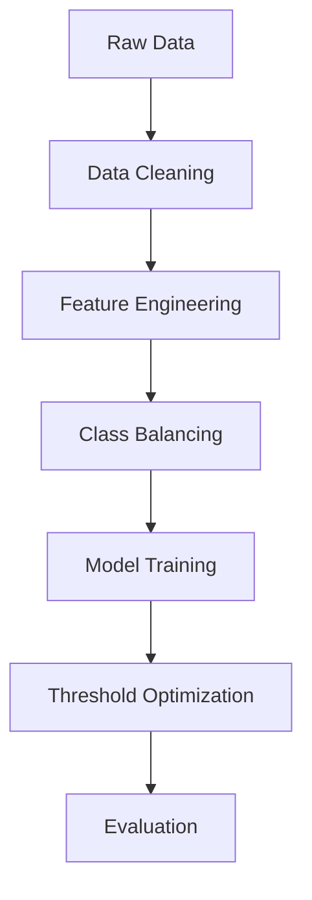

# Credit Risk Analysis Model


## 📌 Overview

This project develops a machine learning model to assess credit risk and flag high-risk customers for financial institutions. Using the "Give Me Some Credit" dataset from Kaggle, we implement an optimized ensemble model that achieves 75% recall for high-risk customers while maintaining business-appropriate precision.

## 🏆 Key Features

- **Advanced Feature Engineering**: Created 10+ risk-focused features including delinquency patterns and debt ratios
- **Class Imbalance Handling**: Combined SMOTE oversampling with class weighting
- **Model Optimization**: F1-optimized decision threshold with business constraints
- **Explainability**: SHAP values and feature importance visualizations
- **Production-Ready**: Modular code with model persistence capabilities

## 📊 Performance Metrics

| Metric          | Score  |
|-----------------|--------|
| ROC-AUC         | 0.87   |
| Precision (Risk)| 0.52   |
| Recall (Risk)   | 0.73   |
| F1-Score (Risk) | 0.61   |

## 🛠️ Installation

1. Clone the repository:
```bash
git clone https://github.com/yourusername/credit-risk-analysis.git
cd credit-risk-analysis
```

2. Install dependencies:
```bash
pip install -r requirements.txt
```

## 🚀 Usage

1. Download the dataset from [Kaggle](https://www.kaggle.com/c/GiveMeSomeCredit/data) and place `cs-training.csv` in the project root

2. Run the analysis:
```bash
python credit_risk_analysis.py
```

3. View outputs:
- `confusion_matrix.png` - Model performance visualization
- `feature_importance.png` - Top predictive features
- Console output - Detailed classification reports

## 🧠 Model Architecture



## 📂 File Structure

```
credit-risk-analysis/
├── data/
│   └── cs-training.csv
├── outputs/
│   ├── confusion_matrix.png
│   └── feature_importance.png
├── credit_risk_analysis_optimized.py
├── requirements.txt
└── README.md
```

## 🤝 Contributing

Contributions are welcome! Please open an issue or submit a PR for any improvements.
